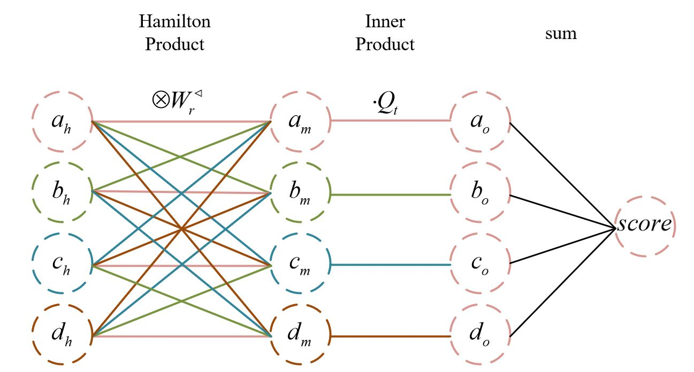
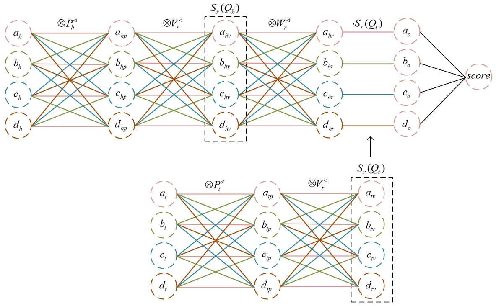

# QuatDE

## Model Architecture
**QuatE**


**QuatDE**


## **How to run:**


```
CUDA_VISIBLE_DEVICES=0 python3 train_QuatDE_dataset.py
```

This code is based on the [OpenKE](https://github.com/thunlp/OpenKE) and [QuatE](https://github.com/cheungdaven/QuatE) project.
